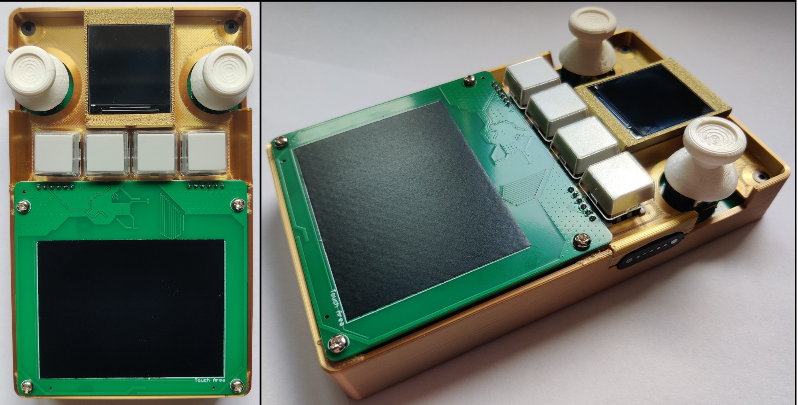

# RoKeyTrackPad

Also see [RoKeyPad](https://github.com/Rochwald/qmk_firmware/tree/master/keyboards/rokeypad/v2_0).

4x1 macropad with 240x240 color display, 2 joysticks, trackpad and magnetic USB interface to easily add more modules for a lot of customizability. Trackpad is implemented on separate PCB with I2C signals exposed, so in theory, any I2C device can be connected instead of the trackpad module for further customizability.

* Keyboard Maintainer: [Rok Hrovat](https://github.com/Rochwald)
* Hardware Supported: Custom PCB using STM32F4
* Hardware design files: [LINK 1](https://github.com/Rochwald/RoKeyPad_Hardware/tree/master/RoKeyPad_v2.1_controller) and [LINK 2](https://github.com/Rochwald/RoKeyPad_Hardware/tree/master/RoKeyPad_v2.1_trackpad) 

Make example for this keyboard (after setting up your build environment):

    make rokeypad/v2_1_trackpad:default

 Or use command 
    
    qmk compile -kb rokeypad/v2_1_trackpad -km default

with QMK MSYS.

Flashing example for this keyboard:

    make rokeypad/v2_1_trackpad:default:flash

Or use [QMK Toolbox](https://qmk.fm/toolbox) utility. 2 versions of prebuilt firmwares are also available, default and Via compatible. As of now, there is no way to customize trackpad and joystick behaviour with Via, only the 4 keys.

See the [build environment setup](getting_started_build_tools) and the [make instructions](getting_started_make_guide) for more information. Brand new to QMK? Start with our [Complete Newbs Guide](newbs).

## Bootloader

Enter the bootloader in 3 ways:

* **Bootmagic reset**: Hold down the key at (0,0) in the matrix (left rotary encoder) and plug in the keyboard
* **Physical reset button**: Press the and hold both the RESET and BOOT1 buttons on the back of the PCB. After 2s, release reset button
* **Keycode in layout**: Press the key mapped to `QK_BOOT` if it is available